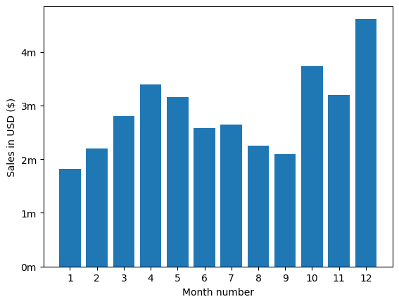

# Overview

In this project, I analyzed a year's worth of sales data by merging monthly sales reports into a comprehensive dataset. My analysis involved rigorous data cleaning—including handling missing values and incorrect entries—and ensuring the accuracy of data types. After cleaning and preparing the data, I investigated key business questions such as identifying the best month for sales, determining which city generated the most sales, analyzing optimal advertisement timing, understanding product bundling patterns, and highlighting the most popular products. This provided valuable insights to inform business decisions on marketing, product strategy, and sales optimization.
 
The dataset and the foundational concepts for this analysis were provided by [Keith Galli](https://www.youtube.com/watch?v=eMOA1pPVUc4&t=2s&ab_channel=KeithGalli) as part of his comprehensive data analytics tutorials, making this project both educational and practical.

# The Questions

Here are the key questions I aim to answer in this project:

1. What was the best month for sales? How much was earned that month?
2. What city had the highest number of sales? 
3. What time should we display advertisements to maximize likelihood of customers buying products?  
4. What products are most often sold together?
5. What product sold the most? Why do you think it sold the most?  

# Tools I Used

While cleaning up the data and answering the questions above, I utilized several essential tools:  

- **Python:** The backbone of this analysis, allowing me to extract and interpret meaningful trends from the dataset. I utilized the following key libraries:  
  - **Pandas:** Essential for handling, transforming, and analyzing structured data efficiently.  
  - **Matplotlib:** Used to generate clear and informative visualizations to support insights.  
- **Jupyter Notebooks:** Offered an interactive and organized environment for executing Python code while seamlessly documenting the process. 
- **Visual Studio Code:** Served as my main code editor, helping me efficiently manage and execute scripts.
- **Git & GitHub:** Played a crucial role in version control, tracking changes, and making my work accessible for collaboration and transparency. 

# Data Preparation and Cleanup

This section details the steps undertaken to prepare the data for analysis, focusing on ensuring its accuracy and usability.

## Import & Clean Up Data

I begin by importing the required libraries and loading the dataset, followed by performing initial data cleaning to ensure high data quality.

```python
# Importing Libraries
import os
import pandas as pd
```

Then I merged my data from each month into one single CSV.

```python

df = pd.read_csv("./Sales_Data/Sales_April_2019.csv")

files = [file for file in os.listdir('./Sales_Data')]

all_months_data = pd.DataFrame()

for file in files: 
    df = pd.read_csv("./Sales_Data/"+file)
    all_months_data = pd.concat([all_months_data, df])

all_months_data.to_csv("all_data.csv", index=False)

```

I read my updated dataframe.

```python
all_data = pd.read_csv("all_data.csv")
all_data.head()
```

### Cleaning up the data

In order to make the correct assumptions in my analysis, I had to address many issues whil cleaning up the data I worked with. 

For instance, first of, I dropped rows of NaN:

```python
nan_df = all_data[all_data.isna().any(axis=1)]
nan_df.head()

all_data = all_data.dropna(how='all')
all_data.head()
```
The CSV file had columns that were not in the correct data type so I converted them:

```python
all_data['Quantity Ordered'] = pd.to_numeric(all_data['Quantity Ordered'])
all_data['Price Each'] = pd.to_numeric(all_data['Price Each'])
```

I also needed to add some new columns in order to analyze and get to clear assumptions on the data. For instance, creating a ['Month'] column was vital to the analysis: 

```python
all_data['Month'] = all_data['Order Date'].str[0:2]
all_data['Month'] = all_data['Month'].astype('int32') 
all_data.head()
```

In addition to these, I had to make several other cleaning such as getting rid of unnecessary text, converting the type of columns, adding new columns, etc. If you'd like, you can check them out in detail in the [Jupyter notebook](Sales_Data/SalesAnalysis.ipynb). I prefer not to list them all here so as not to drown the reader in details.

# The Analysis

## 1. What was the best month for sales? How much was earned that month?

Since I already created a ['Month'] column, I included it along with the columns ['Quantity_Ordered'] ['Price_Each']," and ['Sales']." I then aggregated total sales per month to determine the highest revenue month.

```python
all_data['Sales'] = all_data['Quantity Ordered'].astype('int') * all_data['Price Each'].astype('float')
```

```python
results = all_data.groupby('Month')[['Quantity Ordered', 'Price Each', 'Sales']].sum()

results
```

Then I used matplotlib library to visualize my findings.

```python
import matplotlib.pyplot as plt

months = range(1,13)

plt.bar(months, results['Sales'])
plt.xticks(months)
plt.ylabel('Sales in USD ($)')
plt.xlabel('Month number')
plt.show()
```

### Results

)

*A visualization of sales trends over the year, showing significant growth in Q4, peaking in December. Notable dips in mid-year highlight potential seasonal patterns or market fluctuations.*

### Insights

- Steady Growth in Q1 & Q2: Sales increased consistently from January to April, indicating strong early-year performance.
- Peak in April & May: The highest sales in the first half of the year occurred in April and May, suggesting possible seasonal demand or promotional activities.
- Mid-Year Dip: Sales declined from June to September, indicating a slowdown—potentially due to seasonal trends, market saturation, or reduced consumer spending.
- Q4 Surge: A significant spike in sales occurred in October, November, and especially December, suggesting strong holiday-season demand.
- December as the Best Month: The highest sales volume was recorded in December, possibly driven by holiday shopping, year-end budgets, or promotional campaigns.
- Opportunity for Mid-Year Boost: Given the dip in sales from June to September, strategic marketing efforts, discounts, or new product launches could help maintain momentum during this period.  

## 2. What city had the highest number of sales?

To determine this, I extracted the city name from the "Purchase Address" column. Then, I grouped the data by city and summed up the total sales for each location. This allowed me to identify the city with the highest number of sales and analyze geographical trends in purchasing behavior.

```python
results = all_data.groupby('City')[['Quantity Ordered', 'Price Each']].sum()
```

You can view my notebook with detailed steps here: [SalesAnalysis.ipynb](SalesAnalysis\SalesAnalysis.ipynb).

### Visualize Data

```python
import matplotlib.pyplot as plt
import matplotlib.ticker as mtick

sales_by_city = all_data.groupby('City')['Sales'].sum()

keys = sales_by_city.index

plt.bar(keys, sales_by_city.values, align='center')
plt.ylabel('Sales in USD ($)')
plt.xlabel('City')
plt.xticks(rotation='vertical', size=8)

# Define a custom formatter to display ticks as 1m, 2m, etc.
def millions(x, pos):
    return f'{x/1_000_000:.0f}m'

plt.gca().yaxis.set_major_formatter(mtick.FuncFormatter(millions))
plt.show()
````
### Results


*Bar chart showcasing number of sales per city in the US.*

### Insights:
- Urban centers typically have a significantly higher population concentration. This density naturally leads to a greater volume of potential buyers, which is reflected in the increased sales figures. In high-density areas, the sheer number of consumers drives up transaction frequency, contributing to robust overall sales volumes.

- Cities like San Francisco, Los Angeles, and New York City are not only densely populated but also feature a higher concentration of affluent consumers with greater disposable incomes. This economic vitality means that individuals in these regions are more likely to engage in discretionary spending, thereby boosting sales further. In contrast, smaller markets may experience less economic activity and lower average income levels, which can dampen consumer spending.

## 3. What time should we display advertisements to maximize likelihood of customer's buying product?

### Type conversion

Firstly, I had to change the type of the values on the 'Order Date' column into 'datetime' format because the task in essence requires me to find the time.

```python 
all_data['Order Date'] = pd.to_datetime(all_data['Order Date'])
```
And then, the logical thing was to handpick the Hour and the Minute, so I created separate columns for them.

```python 
all_data['Hour'] = all_data['Order Date'].dt.hour
all_data['Minute'] = all_data['Order Date'].dt.minute
all_data.head()
```

### Visualize Data

```python
hours = [hour for hour, df in all_data.groupby('Hour')]

plt.plot(hours, all_data.groupby(['Hour']).count())
plt.xticks(hours)
plt.xlabel('Hour')
plt.ylabel('Number of Orders')
plt.grid()
plt.show()

```
### Results

\
*Line chart displaying the number of orders per hour of day.*

### Insights

- Sales data shows **11 AM and 7 PM as peak buying hours** during the day.  
- **11 AM peak** likely occurs as people complete their morning routines and have time to make purchases before lunch or mid-day meetings.  
- **7 PM peak** aligns with the post-work relaxation period when consumers are home and more likely to browse and shop online.  
- **Digital ads** (Google, Facebook, Instagram, YouTube) should be scheduled **between 10:30 AM – 12 PM and 6:30 PM – 8 PM** to target high-conversion windows.  
- **Email campaigns and push notifications** should be sent **before peak hours (10 AM and 6 PM)** to drive engagement.  

### Highest Paid & Most Demanded Skills for Data Analysts

Next, I refined my analysis to focus specifically on Data Analyst roles. I examined the highest-paying skills and the most in-demand skills, presenting the findings using two bar charts.

#### Visualize Data

```python

fig, ax = plt.subplots(2, 1)  

# Top 10 Highest Paid Skills for Data Analysts
sns.barplot(data=df_DA_top_pay, x='median', y=df_DA_top_pay.index, hue='median', ax=ax[0], palette='dark:b_r')

# Top 10 Most In-Demand Skills for Data Analystsr')
sns.barplot(data=df_DA_skills, x='median', y=df_DA_skills.index, hue='median', ax=ax[1], palette='light:b')

plt.show()

```

#### Results
Here’s an overview of the highest-paying and most in-demand skills for Data Analysts in the United States:


*Two distinct bar charts illustrating the highest-paying skills and the most in-demand skills for Data Analysts in the United States.*

#### Insights:

- The top chart reveals that specialized technical skills such as `dplyr`, `Bitbucket`, and `Gitlab` are linked to higher salaries, with some reaching up to $200K. This indicates that advanced technical expertise significantly boosts earning potential.

- The bottom chart shows that foundational skills like `Excel`, `PowerPoint`, and `SQL` are the most sought-after, even though they may not lead to the highest salaries. This underscores the essential role these core skills play in securing data analysis positions.

- There is a distinct difference between the skills associated with the highest salaries and those most in demand. To maximize career opportunities, data analysts should aim to build a well-rounded skill set that incorporates both high-paying specialized skills and widely demanded foundational skills.

## 4. What are the most optimal skills to learn for Data Analysts?

To determine the most optimal skills to learn (those that are both highly paid and in high demand), I calculated the percentage of skill demand and the median salary for these skills. This approach makes it easier to identify the top skills to focus on.

You can view my notebook with detailed steps here: [5_Optimal_Skills](5_Optimal_Skills.ipynb).

#### Visualize Data

```python
from adjustText import adjust_text
import matplotlib.pyplot as plt

plt.scatter(df_DA_skills_high_demand['skill_percent'], df_DA_skills_high_demand['median_salary'])
plt.show()

```

#### Results

    
*A scatter plot showcasing the most optimal skills for Data Analysts in the US, highlighting those that are both high-paying and in high demand.*

#### Insights:

- The skill `Oracle` stands out with the highest median salary of nearly $97K, despite being less frequently mentioned in job postings, indicating the high value placed on specialized database expertise in the data analyst field.

- Widely required skills like `Excel` and `SQL` are prominent in job postings but tend to have lower median salaries compared to specialized skills such as `Python` and `Tableau`, which offer higher salaries and are moderately common in job listings.

- Skills like `Python`, `Tableau`, and `SQL Server` are positioned near the top of the salary range while also being fairly prevalent in job postings, suggesting that proficiency in these tools can lead to strong career opportunities in data analytics.    

### Visualizing Different Techonologies

Let’s enhance the visualization by including different technologies in the graph. We'll assign color labels based on the type of technology (e.g., {Programming: Python}).

#### Visualize Data

```python
from matplotlib.ticker import PercentFormatter

# Create a scatter plot
scatter = sns.scatterplot(
    data=df_DA_skills_tech_high_demand,
    x='skill_percent',
    y='median_salary',
    hue='technology',  # Color by technology
    palette='bright',  # Use a bright palette for distinct colors
    legend='full'  # Ensure the legend is shown
)
plt.show()

```

#### Results

  
*A scatter plot showcasing the most optimal skills (those that are high-paying and in high demand) for data analysts in the US, featuring color-coded labels to represent various technologies.*

#### Insights:

- The scatter plot reveals that programming skills (blue) tend to cluster at higher salary levels compared to other categories, highlighting the significant salary benefits associated with programming expertise in the data analytics field.

- Database skills (orange), such as Oracle and SQL Server, are linked to some of the highest salaries among data analyst tools, underscoring the high demand and value of data management and manipulation expertise in the industry.

- Analyst tools (green), like Tableau and Power BI, are widely mentioned in job postings and offer competitive salaries. These tools are essential for data roles, providing strong earning potential and versatility across various data tasks.


# What I Learned

This project allowed me to deepen my understanding of the data analyst job market and improve my technical skills in Python. Here are a few key takeaways:

- **Advanced Python Proficiency**: Leveraging libraries such as Pandas for data manipulation, Seaborn and Matplotlib for data visualization, and others enabled me to perform complex analyses more efficiently.  
- **Importance of Data Cleaning**: I learned that thorough data cleaning and preparation are vital to ensure accurate and reliable insights during analysis.  
- **Strategic Skill Assessment**: This project underscored the importance of aligning skills with market demand. Understanding the connection between skill demand, salary, and job availability is critical for informed career planning in tech.


# Insights

This project offered several important insights into the data analyst job market:

- **Correlation Between Skill Demand and Salary**: Skills that are in high demand, such as Python and Oracle, often command higher salaries, showcasing a clear relationship between market demand and compensation.  
- **Evolving Market Trends**: Skill demand in the data analytics field evolves, emphasizing the need to stay updated with industry trends for sustained career growth.  
- **Economic Value of Skill Development**: Identifying skills that are both in-demand and well-compensated can help data analysts prioritize their learning efforts to maximize career and financial returns.


# Challenges I Faced  

This project came with its share of challenges, offering valuable learning experiences:  

- **Data Inconsistencies**: Managing missing or inconsistent data entries required meticulous data-cleaning techniques to maintain the integrity and reliability of the analysis.  
- **Complex Data Visualization**: Creating clear and effective visualizations for complex datasets was challenging but essential for presenting insights in a compelling and understandable way.  
- **Balancing Breadth and Depth**: Striking the right balance between diving deeply into specific analyses and maintaining a broad overview of the data landscape was a constant challenge to ensure thorough coverage without losing focus.  


# Conclusion  

This analysis of the data analyst job market has been highly insightful, shedding light on the key skills and trends that define this dynamic field. The findings not only deepen my understanding but also offer actionable guidance for anyone aiming to advance in data analytics. As the industry continues to evolve, ongoing analysis will be crucial to staying competitive. This project serves as a strong foundation for future research and emphasizes the importance of continuous learning and adaptability in the data analytics profession. And last but not the least, a massive thanks to the amazing [Luke Barousse](https://www.lukebarousse.com/). Without him, this project would never exist.

