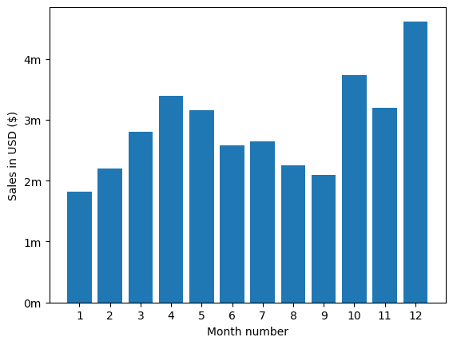
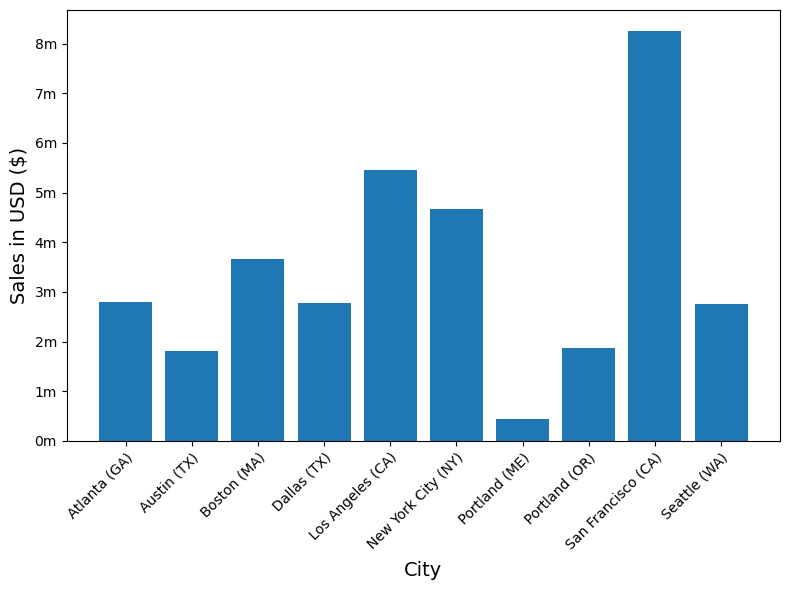
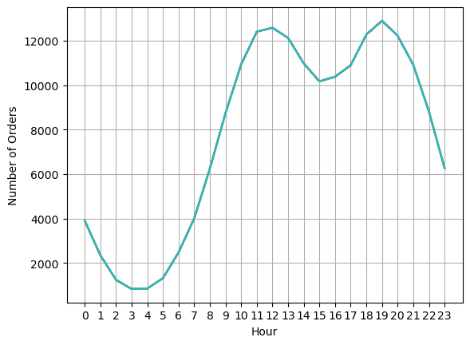
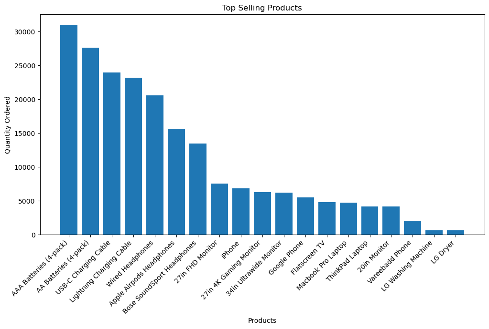
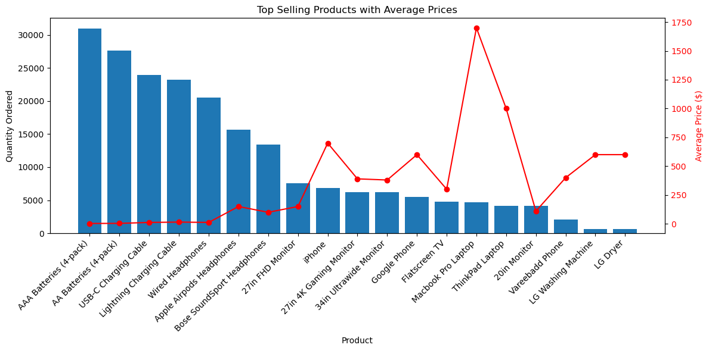

# Overview

Welcome to my Sales Analysis project. In this project, I analyzed a year's worth of sales data by merging monthly sales reports into a comprehensive dataset. My analysis involved rigorous data cleaning—including handling missing values and incorrect entries—and ensuring the accuracy of data types. After cleaning and preparing the data, I investigated key business questions such as identifying the best month for sales, determining which city generated the most sales, analyzing optimal advertisement timing, understanding product bundling patterns, and highlighting the most popular products. This provided valuable insights to inform business decisions on marketing, product strategy, and sales optimization.
 
The dataset and the foundational concepts for this analysis were provided by [Keith Galli](https://www.youtube.com/watch?v=eMOA1pPVUc4&t=2s&ab_channel=KeithGalli) as part of his comprehensive data analytics tutorials, making this project both educational and practical.

# The Questions

Here are the key questions I aim to answer in this project:

1. What was the best month for sales? How much was earned that month?
2. What city had the highest number of sales? 
3. What time should we display advertisements to maximize likelihood of customers buying products?  
4. What products are most often sold together?
5. What product sold the most? Why do you think it sold the most?  

# Tools I Used

While cleaning up the data and answering the questions above, I utilized several essential tools:  

- **Python:** The backbone of this analysis, allowing me to extract and interpret meaningful trends from the dataset. I utilized the following key libraries:  
  - **Pandas:** Essential for handling, transforming, and analyzing structured data efficiently.  
  - **Matplotlib:** Used to generate clear and informative visualizations to support insights.  
- **Jupyter Notebooks:** Offered an interactive and organized environment for executing Python code while seamlessly documenting the process. 
- **Visual Studio Code:** Served as my code editor, helping me efficiently manage and execute scripts.
- **Git & GitHub:** Played a crucial role in version control, tracking changes, and making my work accessible for collaboration and transparency. 

# Data Preparation and Cleanup

This section details the steps undertaken to prepare the data for analysis, focusing on ensuring its accuracy and usability.

## Import & Clean Up Data

I began by importing the required libraries and loading the dataset, followed by performing initial data cleaning to ensure high data quality.

```python
# Importing Libraries
import os
import pandas as pd
```

Then I merged my data from each month into one single CSV.

```python

df = pd.read_csv("./Sales_Data/Sales_April_2019.csv")

files = [file for file in os.listdir('./Sales_Data')]

all_months_data = pd.DataFrame()

for file in files: 
    df = pd.read_csv("./Sales_Data/"+file)
    all_months_data = pd.concat([all_months_data, df])

all_months_data.to_csv("all_data.csv", index=False)

```

I then read my updated dataframe.

```python
all_data = pd.read_csv("all_data.csv")
all_data.head()
```

## Cleaning up the data

In order to make the correct assumptions in my analysis, I had to address many issues whil cleaning up the data I worked with. 

For instance, first of, I dropped rows of NaN:

```python
nan_df = all_data[all_data.isna().any(axis=1)]
nan_df.head()

all_data = all_data.dropna(how='all')
all_data.head()
```
The CSV file had columns that were not in the correct data type so I converted them:

```python
all_data['Quantity Ordered'] = pd.to_numeric(all_data['Quantity Ordered'])
all_data['Price Each'] = pd.to_numeric(all_data['Price Each'])
```

I also needed to add some new columns in order to analyze and get to clear assumptions on the data. For instance, creating a ['Month'] column was vital to the analysis: 

```python
all_data['Month'] = all_data['Order Date'].str[0:2]
all_data['Month'] = all_data['Month'].astype('int32') 
all_data.head()
```

In addition to these, I had to make several other cleaning such as getting rid of unnecessary text, converting the type of columns, adding new columns, etc. If you'd like, you can check them out in detail in the [Jupyter notebook](SalesAnalysis/SalesAnalysis.ipynb). I prefer not to list them all here so as not to drown the reader in details.

# The Analysis

## Question #1: What was the best month for sales? How much was earned that month?

Since I already created a ['Month'] column, I included it along with the columns ['Quantity_Ordered'] ['Price_Each']," and ['Sales']." I then aggregated total sales per month to determine the highest revenue month.

```python
all_data['Sales'] = all_data['Quantity Ordered'].astype('int') * all_data['Price Each'].astype('float')
```

```python
results = all_data.groupby('Month')[['Quantity Ordered', 'Price Each', 'Sales']].sum()

results
```

Then I used matplotlib library to visualize my findings.

```python
import matplotlib.pyplot as plt

months = range(1,13)

plt.bar(months, results['Sales'])
plt.xticks(months)
plt.ylabel('Sales in USD ($)')
plt.xlabel('Month number')
plt.show()
```

### Results



*A visualization of sales trends over the year, showing significant growth in Q4, peaking in December. Notable dips in mid-year highlight potential seasonal patterns or market fluctuations.*

### Insights

- Steady Growth in Q1 & Q2: Sales increased consistently from January to April, indicating strong early-year performance.
- Peak in April & May: The highest sales in the first half of the year occurred in April and May, suggesting possible seasonal demand or promotional activities.
- Mid-Year Dip: Sales declined from June to September, indicating a slowdown—potentially due to seasonal trends, market saturation, or reduced consumer spending.
- Q4 Surge: A significant spike in sales occurred in October, November, and especially December, suggesting strong holiday-season demand.
- December as the Best Month: The highest sales volume was recorded in December, possibly driven by holiday shopping, year-end budgets, or promotional campaigns.
- Opportunity for Mid-Year Boost: Given the dip in sales from June to September, strategic marketing efforts, discounts, or new product launches could help maintain momentum during this period.  

## Question #2: What city had the highest number of sales?

To determine this, I extracted the city name from the "Purchase Address" column. Then, I grouped the data by city and summed up the total sales for each location. This allowed me to identify the city with the highest number of sales and analyze geographical trends in purchasing behavior.

```python
results = all_data.groupby('City')[['Quantity Ordered', 'Price Each']].sum()
```

You can view my notebook with detailed steps here: [SalesAnalysis.ipynb](SalesAnalysis/SalesAnalysis.ipynb).

### Visualize Data

```python
import matplotlib.pyplot as plt
import matplotlib.ticker as mtick

sales_by_city = all_data.groupby('City')['Sales'].sum()

keys = sales_by_city.index

plt.bar(keys, sales_by_city.values, align='center')
plt.ylabel('Sales in USD ($)')
plt.xlabel('City')
plt.xticks(rotation='vertical', size=8)

# Define a custom formatter to display ticks as 1m, 2m, etc.
def millions(x, pos):
    return f'{x/1_000_000:.0f}m'

plt.gca().yaxis.set_major_formatter(mtick.FuncFormatter(millions))
plt.show()
````
### Results



*Bar chart showcasing number of sales per city in the US.*

### Insights:
- Urban centers typically have a significantly higher population concentration. This density naturally leads to a greater volume of potential buyers, which is reflected in the increased sales figures. In high-density areas, the sheer number of consumers drives up transaction frequency, contributing to robust overall sales volumes.

- Cities like San Francisco, Los Angeles, and New York City are not only densely populated but also feature a higher concentration of affluent consumers with greater disposable incomes. This economic vitality means that individuals in these regions are more likely to engage in discretionary spending, thereby boosting sales further. In contrast, smaller markets may experience less economic activity and lower average income levels, which can dampen consumer spending.

## Question #3: What time should we display advertisements to maximize likelihood of customer's buying product?

### Type conversion

Firstly, I had to change the type of the values on the 'Order Date' column into 'datetime' format because the task in essence requires me to find the time.

```python 
all_data['Order Date'] = pd.to_datetime(all_data['Order Date'])
```
And then, the logical thing was to handpick the Hour and the Minute, so I created separate columns for them.

```python 
all_data['Hour'] = all_data['Order Date'].dt.hour
all_data['Minute'] = all_data['Order Date'].dt.minute
all_data.head()
```

### Visualize Data

```python
hours = [hour for hour, df in all_data.groupby('Hour')]

plt.plot(hours, all_data.groupby(['Hour']).count())
plt.xticks(hours)
plt.xlabel('Hour')
plt.ylabel('Number of Orders')
plt.grid()
plt.show()

```
### Results

\
*Line chart displaying the number of orders per hour of day.*

### Insights

- Sales data shows **11 AM and 7 PM as peak buying hours** during the day.  
- **11 AM peak** likely occurs as people complete their morning routines and have time to make purchases before lunch or mid-day meetings.  
- **7 PM peak** aligns with the post-work relaxation period when consumers are home and more likely to browse and shop online.  
- **Digital ads** (Google, Facebook, Instagram, YouTube) should be scheduled **between 10:30 AM – 12 PM and 6:30 PM – 8 PM** to target high-conversion windows.  
- **Email campaigns and push notifications** should be sent **before peak hours (10 AM and 6 PM)** to drive engagement.  

## Question 4: What products are most often sold together?

Firstly, I detected Frequently Bought Together Items Using GroupBy and Transform methods.

```python
df = all_data[all_data['Order ID'].duplicated(keep=False)]

df['Grouped'] = df.groupby('Order ID')['Product'].transform(lambda x: ', '.join(x))

df.head()

df = df[['Order ID', 'Grouped']].drop_duplicates()

df.head(100)
```

I then analyzed grouped transactions to find the most common product pairs by generating 2-item combinations with `itertools` and counting their frequency using `Counter`, revealing frequently bought together items for potential bundling insights.

```python
from itertools import combinations
from collections import Counter

count = Counter()

for row in df['Grouped']:
    row_list = row.split(',')
    count.update(Counter(combinations(row_list, 2)))

for key, value in count.most_common(10):
    print(key, value)
```

#### Insights:

- **Phone and cable purchases are tightly linked**: Customers frequently buy charging cables with phones, indicating bundling opportunities or a need to highlight compatible accessories at checkout.

- **Wired headphones remain popular**: Despite the rise of wireless options, many customers still pair phones with wired headphones, suggesting continued demand for budget audio options.

- **Brand-specific accessory preferences are clear**: iPhone buyers lean toward Apple AirPods, while Google Phone buyers prefer Bose SoundSport, showing a tendency toward brand-aligned premium accessories.

- **Vareebadd Phone users heavily purchase accessories**: Although not as high in volume, Vareebadd consistently appears with essential add-ons, indicating a loyal base or gaps in included items.

- **Accessories are frequently bought together**: Items like USB-C cables and wired headphones are paired independently of phones, suggesting accessory-only purchase behavior worth targeting.

## Question #5: What product sold the most? Why do you think it sold the most?

(See all of the steps for answering Question 5 in detail in [SalesAnalysis.ipynb](SalesAnalysis/SalesAnalysis.ipynb).)

### Summing Product Quantities and Selecting Top 10

I first  grouped the data by product and summed the total quantities ordered to calculate overall sales volume per item. Using .head(10), I then extracted the top 10 best-selling products to quickly identify which items had the highest purchase frequency.

```python 
# Group by product and sum the quantities
product_sales = all_data.groupby('Product')['Quantity Ordered'].sum()

# Sort by most sold products
print(product_sales.sort_values(ascending=False).head(10))
```

Then I simply visualized this:

### Visualize Data

```python
product_sales = all_data.groupby('Product')['Quantity Ordered'].sum()

# Sort products by sales
product_sales = product_sales.sort_values(ascending=False)

# Plot the data
plt.figure(figsize=(12, 6))
plt.bar(product_sales.index, product_sales.values)

# Add labels and title
plt.xlabel('Products')
plt.ylabel('Quantity Ordered')
plt.title('Top Selling Products')
plt.xticks(rotation=45, ha='right')

# Show the plot
plt.show()

```


*Line chart displaying top 10 products in the dataset.*

Upon which, I embarked on the "why" of the question. One of the things I knew I had to do was to find the average prices of these products since buying behavior cannot be explained without them. My hypothesis was that the higher price the product had, the less it sold.

### Finding the average price

```python
all_data['Price Each'] = pd.to_numeric(all_data['Price Each'], errors='coerce')

prices = all_data.groupby('Product')['Price Each'].mean()

print(prices)
```

Then I plotted my findings in a single chart, creating an overlay of the average prices on top of the quantities ordered:

### Visualize Data

```python
# Grouping data
product_sales = all_data.groupby('Product')['Quantity Ordered'].sum().sort_values(ascending=False)
prices = all_data.groupby('Product')['Price Each'].mean()

# Create a new figure with appropriate size
fig, ax1 = plt.subplots(figsize=(12, 6))

# Plot the bar chart on ax1 for Quantity Ordered
ax1.bar(product_sales.index, product_sales.values, label='Quantity Ordered')
ax1.set_xlabel('Product')
ax1.set_ylabel('Quantity Ordered', color='black')
ax1.tick_params(axis='y', labelcolor='black')
ax1.set_xticklabels(product_sales.index, rotation=45, ha='right')

# Create a twin axis sharing the same x-axis for the average price line chart
ax2 = ax1.twinx()
# Ensure the prices are in the same order as product_sales
ax2.plot(product_sales.index, prices.loc[product_sales.index], color='red', marker='o', label='Average Price')
ax2.set_ylabel('Average Price ($)', color='red')
ax2.tick_params(axis='y', labelcolor='red')

# Add a title and adjust layout
plt.title('Top Selling Products with Average Prices')
fig.tight_layout()

plt.show()
```

   
*Bar chart of top-selling products by quantity, overlayed with a line chart of their average prices.*


## Insights

- **Observing an inverse relationship between price and quantity sold**: There is a clear negative correlation between a product's price and its sales volume. Lower-priced items like batteries and charging cables dominate in quantity sold, while higher-priced items, such as laptops and large electronics, sell less frequently.

- **MacBook Pro defies the price-to-demand trend**: Despite being the most expensive item on the chart, the MacBook Pro outperforms several cheaper alternatives in sales volume—including the ThinkPad, which costs roughly two-thirds as much. This suggests strong consumer trust and brand preference for Apple, likely driven by its reputation for reliability and performance.

# What I Learned

This project deepened my understanding of sales trends throughout a typical year in the US, highlighting seasonal patterns, consumer behavior, and product performance. Here are a few key takeaways:

- **December Dominates Sales, January Slows Down**  
  The holiday season drives a clear sales peak in December, making it the most profitable month. In contrast, January sees the lowest sales—likely due to budget resets and post-holiday recovery.

- **High-End Brands Like Apple Defy Price Trends**  
  Despite the usual pattern of lower prices leading to higher sales volumes, premium products like iPhones and MacBook Pros consistently sell well. This shows that brand reputation and perceived quality can outweigh price sensitivity.

- **Sales Spike at 11 AM and 7 PM**  
  The most active shopping hours are around 11 AM and 7 PM. The morning peak likely comes after people finish their routines, while the evening surge aligns with relaxation time after work, often spent browsing online.

- **Utility Products Drive Consistent Volume**
Everyday items like phone accessories, batteries, and cables maintain strong sales across months. Their frequent use and relatively low cost make them consistent performers, even outside major sales periods.


# Challenges I Faced  

The project was not without its challenges. Those challenges pushed my limits with regards to my Python/Pandas know-how:  

- **Extensive Data Cleaning Required**: The original dataset contained many inconsistencies such as missing values (NaNs), incorrect data formats, and typos in column headers. I had to clean each monthly file, convert data types (e.g., strings to datetime or numeric), and drop or impute invalid rows before analysis. Combining all 12 monthly CSV files into one clean dataset was a crucial early step.

- **Parsing and Extracting Useful Information from Text Columns**: Several important features like city names, product categories, and timestamps were embedded within longer text strings. For example, extracting city names from addresses or calculating hour-wise sales from timestamps required detailed parsing and feature engineering.

- **Advanced Plotting with Matplotlib**: Plotting using Matplotlib sometimes required more advanced techniques, especially when dealing with grouped data or time-based trends, which contributed to my learning.

# Conclusion

This sales data analysis project has been a rewarding experience, offering valuable insights into consumer behavior, sales trends, and the power of data-driven decision-making. Working through the challenges of cleaning, merging, and visualizing the data has not only strengthened my technical skills but also highlighted the real-world impact of data analytics in a business context. As markets continue to shift, regularly analyzing sales data will remain essential for staying ahead of the curve. This project lays a strong groundwork for future explorations into business intelligence and reinforces the value of curiosity, problem-solving, and continuous learning. And last but not least, a big shoutout to the brilliant [Keith Galli](https://www.youtube.com/@KeithGalli)—this project wouldn't have come to life without his guidance and inspiration.


